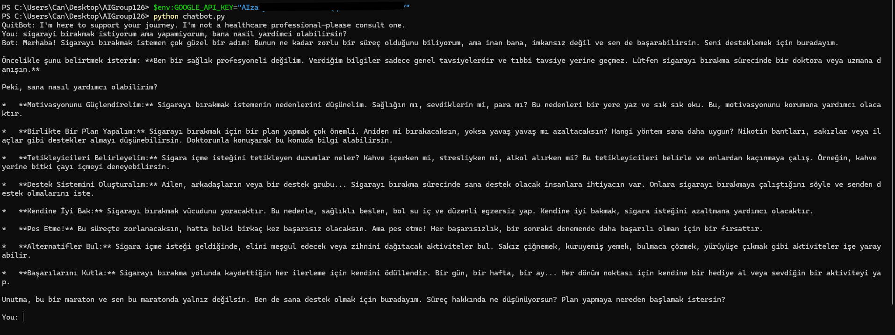

# AIGroup126 - Quit Smoking Chatbot (Gemini API)

---

## 👥 AI Grup 126 GitHub Ekibi

- **Can Özaslangöz** – Scrum Master / Product Owner  
  (Projeyi tasarlayan, geliştiren ve tamamlayan tek resmi ekip üyesidir.)

### 📝 Not:
Proje başlangıcında Maryam Kholmatova ve Elifnur Aydınoğlu sınamalı üye olarak eklenmişlerdir.  
Ancak 1. ve 2. sprint boyunca yoğunlukları ve ilgisizlikleri nedeniyle ürün geliştirme sürecine **aktif olarak katkı sağlamamışlardır**.  
Bu nedenle sprint 3 itibarıyla **ekibin tek resmi üyesi Can Özaslangöz olarak kabul edilmektedir**.

---

## 🟢 Sprint 1

### ✅ Sprint Notları
- Sprint süreci zorluydu, düzenli bir işleyiş sağlanamadı.  
- Sınamalı üyeler dahil olmalarına rağmen aktif katkıda bulunmadılar.  
- Scrum Master olarak iletişim ve süreç yönetimi Can Özaslangöz tarafından yürütüldü.  
- Diğer adaylardan yanıt alınamadı veya sürece katılım sağlanmadı.  

### ✅ Sonuç
- Sınamalı üyeler listede yer aldı ancak aktif katılım göstermediler.  
- Ürün geliştirmesi bu sprintte yapılamadı.

---

## 🟢 Sprint 2

### ✅ Sprint Notları
- 2. sprintte de sınamalı üyelerin ilgisizliği devam etti.  
- Ürün geliştirme adımları tek başına Can Özaslangöz tarafından yürütüldü.  
- Ürün planı netleşti: **Sigara bırakma sürecinde destek sağlayan chatbot**.  
- API araştırması tamamlandı, **Gemini API** ile ilerleme kararı verildi.

---

## 🟢 Sprint 3

### ✅ Sprint Notları
- Sprint 3 boyunca ürün tamamen **Can Özaslangöz tarafından tek başına** geliştirildi.  
- Sınamalı üyeler bu sprintte de katkı sunmadı.  
- Chatbot’un tüm fonksiyonları başarıyla tamamlandı ve GitHub’a yüklendi.

### ✅ Tahmin Edilen Puan ve Tamamlanan Puan
- **Tahmin Edilen Puan:** 30  
- **Tamamlanan Puan:** 30  

### ✅ Puan Tamamlama Mantığı
- Hedeflenen tüm özellikler başarıyla uygulandı.

### ✅ Daily Scrum
- Geliştirme süreci bireysel olarak yürütüldü.  
- Teknik hatalar anında çözüldü, günlük ilerleme sağlandı.

### ✅ Sprint Board Updates
- Görevler bireysel olarak tamamlandı.  
- GitHub entegrasyonu başarıyla yapıldı.

### ✅ Ürün Screenshot
📸 **Chatbot Çalışma Örneği**  
Ekran görüntünüzü eklemek için bu dosyayı kullanın:  
```markdown

```

### ✅ Sprint Review
- Çalışan chatbot başarıyla demo edildi.  
- Kullanıcı mesajlarına doğru yanıt veren bir sistem geliştirildi.

### ✅ Sprint Retrospektif
- ✅ **Güçlü Yönler:** Tek başına geliştirilmesine rağmen hızlı ilerleme sağlandı.  
- ❌ **Zayıf Yönler:** Ekip katılımının olmayışı süreçte ekstra yük oluşturdu.  
- 🔥 **Geliştirme Alanları:** İleride Flask arayüzü ve daha geniş özellikler eklenebilir.

---

## 🚀 Proje Kurulumu

### ✅ Kurulum Adımları
1. Python 3.10+ kurulu olmalıdır.
2. Gerekli kütüphaneleri yükleyin:
   ```bash
   python -m pip install -r requirements.txt
   ```
3. Gemini API anahtarınızı ortam değişkeni olarak ayarlayın:
   ```powershell
   $env:GOOGLE_API_KEY="your-api-key"
   ```
4. Chatbot’u çalıştırın:
   ```bash
   python chatbot.py
   ```

---

## ✅ GitHub Commit Mesajı
```
Initial commit - AIGroup126 Quit Smoking Chatbot
```
